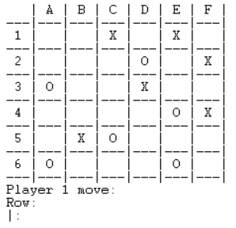

# PLOG 2020/2021 - TP1

## Group: T04_Gekitai5

| Name             | Number    | E-Mail                |
| ---------------- | --------- | --------------------- |
|   Carlos Lousada  | 201806302 | up201806302@fe.up.pt  |
|  José David Rocha   | 201806371 | up201806371@fe.up.pt  |

## Installation and Execution

In order to run our game follow the following steps:

- Install and run SICStus Prolog.
- Go to File > Working Directory and navigate to the *src* folder where you downloaded the code.
- Go to File > Consult and select the file [*gekitai.pl*](../src/gekitai.pl).
- **Alternatively:** run `consult('path\to\gekitai.pl').`
- Type `play.` into the SICStus console and the game will start.

## Gekitai

- Game description:

    - Gekitai (Repel or Push Away) is a 2-person abstract strategy game.
    - Each player has eight colored markers and takes turns placing them anywhere on any open space on the board.
    - When placed, a marker pushes all adjacent pieces outwards one space if there is an open space for it to move to (or off the board).
    - Markers shoved off the board are returned to the player.
    - If there is not an open space on the opposite side of the pushed marker, it does not push
    - The first player to either line up three of their markers in a row at the end of their turn (after pushing) OR have all eight of their markers on the board (also after pushing), is declared the winner.

- Material:
    - A 6×6 board;
    - 16 markers (8 of each color, or, in this case, 'X's and an 'O's).

[Source](https://boardgamegeek.com/boardgame/295449/gekitai)

# Game Logic

## Internal representation of the game state

**Board**

- The board is represented by a list of lists (also referred as a matrix), where each element represents a row. Each row contains 6 elements (one for each column), which represents an empty space, a Player 1 marker or a Player 2 marker (empty, plyr1, plyr2 respectively)

**Player**

- Each atom can either represent a player's marker or an empty space.
  - Player 1's marker is represented by an 'X';
  - Player 2's marker is represented by an 'O';
  - An empty space is represented by ' '.
- The current player to move is displayed, as 'Player 1' or 'Player 2', in the display_game predicate.

**Game Loop**

- In Gekitai, the game starts off with Player 1's move, followed by Player 2's move. Both players take turns until the end of the game.
- Game Loop's Processing:
  - Initially, the predicate initial(GameState) is called in order to initialize an empty board, while also asserting the board's state and Player 1 as first one to move;
  - The board's state is displayed;
  - The predicate playMove is called, which is responsible for verifying if the Player's given move is valid and, if so, replacing the necessary values in the matrix  (which also includes repulsions);
  - The next Player to move is asserted as well as the new game state;
  - The predicate checkVictory is called, which is responsible for verifying if the loop was interrupted by the Pause Menu, as well as checking if and which of the players won. 
- The loop repeats itself until the predicate checkVictory does not fail, meaning either one of the players won the game or it was simply interrupted by the Pause Menu.
- When the game ends the predicate endGame is called, which retracts the previous game state, allowing for a new one to start. Furthermore, it also displays the final board alongside with the winner of the game. If the game was interrupted by the Pause Menu, the Main Menu is called, otherwise the user will be prompted whether or not the program should return to the Main Menu.

**Game States**

- Initial Situation:

```
   initialBoard([
    [empty,empty,empty,empty,empty,empty],
    [empty,empty,empty,empty,empty,empty],
    [empty,empty,empty,empty,empty,empty],
    [empty,empty,empty,empty,empty,empty],
    [empty,empty,empty,empty,empty,empty],
    [empty,empty,empty,empty,empty,empty],
    ]). 
```
       | A | B | C | D | E | F |
    ---|---|---|---|---|---|---|
     1 |   |   |   |   |   |   | 
    ---|---|---|---|---|---|---|
     2 |   |   |   |   |   |   | 
    ---|---|---|---|---|---|---|
     3 |   |   |   |   |   |   | 
    ---|---|---|---|---|---|---|
     4 |   |   |   |   |   |   | 
    ---|---|---|---|---|---|---|
     5 |   |   |   |   |   |   | 
    ---|---|---|---|---|---|---|
     6 |   |   |   |   |   |   | 
    ---|---|---|---|---|---|---|
    Player 1 Move:
    Col:
    |: 


- Intermediate Situation:

```
    intermediateBoard([  
    [empty,empty,plyr1,empty,plyr1,empty],  
    [empty,empty,empty,empty,empty,empty],  
    [plyr2,empty,empty,plyr1,empty,empty],  
    [empty,empty,empty,empty,plyr2,plyr1],  
    [empty,plyr2,empty,empty,empty,empty],  
    [empty,empty,empty,empty,plyr2,empty]  
    ]).
```

        | A | B | C | D | E | F |  
     ---|---|---|---|---|---|---|  
      1 |   |   | X |   | X |   |  
     ---|---|---|---|---|---|---|  
      2 |   |   |   | O |   | X |  
     ---|---|---|---|---|---|---|  
      3 | O |   |   | X |   |   |  
     ---|---|---|---|---|---|---|  
      4 |   |   |   |   | O | X |  
     ---|---|---|---|---|---|---|  
      5 |   | X | O |   |   |   |  
     ---|---|---|---|---|---|---|  
      6 | O |   |   |   | O |   |  
     ---|---|---|---|---|---|---|  
     Player 1 Move:
     Col:
     |:


- Final Situation:

```
  finalBoard([  
    [plyr1,empty,empty,plyr1,empty,empty],  
    [empty,empty,empty,empty,empty,empty],  
    [empty,plyr2,plyr2,plyr2,plyr1,empty],  
    [empty,empty,empty,empty,empty,empty],  
    [plyr2,empty,plyr1,plyr1,empty,empty],  
    [empty,empty,empty,empty,empty,plyr2]  
    ]).
```

        | A | B | C | D | E | F |  
     ---|---|---|---|---|---|---|  
      1 | X |   |   | X |   |   |  
     ---|---|---|---|---|---|---|  
      2 |   |   |   |   |   |   |  
     ---|---|---|---|---|---|---|  
      3 |   | O | O | O | X |   |  
     ---|---|---|---|---|---|---|  
      4 |   |   |   |   |   |   |  
     ---|---|---|---|---|---|---|  
      5 | O |   | X | X |   |   |  
     ---|---|---|---|---|---|---|  
      6 |   |   |   |   |   | O |  
     ---|---|---|---|---|---|---|
     Player 2 wins the game!

## Game State Visualization

To display the board we used the predicates display_game(X, Player), printMatrix([], 6) and printLine([]). display_game(X, Player) prints a row of the board, by calling printMatrix([], 6)  on every iteration - printMatrix([], 6) will then make use of predicate printLine([]), which recursively calls itself, printing the Head of the given list in every iteration.

Furthermore, we use "X" and "O" to represent, respectively, Player 1 and Player 2. Empty values are represented by an empty space (" "). With the use of the predicate symbol(Value, S) we were able to display X, O and " " instead of values initially declared on the board's matrix (plyr1, plyr2, empty) which would result in a less user-friendly and easy-to-read game.

- Initial State:

  
  
  - Intermediate State:

  
  
  - Final State:

  

**Menus - menu.pl**

When running the game, the user is prompted to a **MainMenu**, where they can select which game mode they want to play. The available modes are:

- Player vs Player
- Player vs Computer
- Computer vs Computer

  

If the player decides to select a game mode which involves a Computer they are asked about the difficulty of the given Computer, which can either be Easy or Hard.

  

Furthermore, there is also a **Pause Menu**, which can be prompted whilst in game, by typing either 'pause', p or 'P', when asked for either a column or a row. The available options for the Pause Menu are:

	- Resume;
	- Return to Main Menu;
	- Exit game.

If the player decides to resume the game, it continues normally from when it was paused. On the other hand, if the player decides to return to the Main Menu, the game loop is interrupted and the player is prompted to the Main Menu. Finally, if the players chooses to exit the game the execution of the game is aborted.

  

## Valid moves list - [play.pl](https://github.com/Telmo465/PLOG/blob/master/src/play.pl) & [utils.pl](https://github.com/Telmo465/PLOG/blob/master/src/utils.pl)


## Move execution - [input.pl](https://github.com/Telmo465/PLOG/blob/master/src/input.pl) & [play.pl](https://github.com/Telmo465/PLOG/blob/master/src/play.pl)


## Game Over - [play.pl](https://github.com/Telmo465/PLOG/blob/master/src/play.pl) & [utils.pl](https://github.com/Telmo465/PLOG/blob/master/src/utils.pl)


## Board Evaluation - [utils.pl](https://github.com/Telmo465/PLOG/blob/master/src/utils.pl)


## Computer Move - [input.pl](https://github.com/Telmo465/PLOG/blob/master/src/input.pl) & [play.pl](https://github.com/Telmo465/PLOG/blob/master/src/play.pl)


## Conclusions


## Bibliography

- [SWI-Prolog](https://www.swi-prolog.org/);
- [SICStus Prolog Documentation](https://sicstus.sics.se/sicstus/docs/latest4/pdf/sicstus.pdf)
- Moodle slides.


